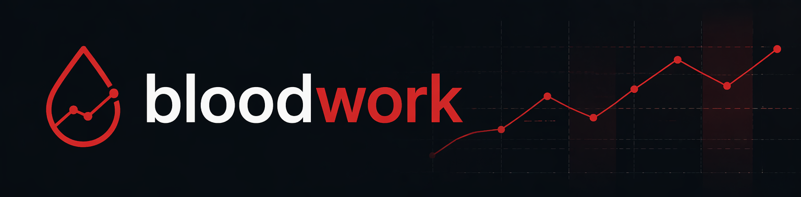

<picture>
  <source media="(prefers-color-scheme: dark)" srcset="README_banner_light.png">
  <source media="(prefers-color-scheme: light)" srcset="README_banner_dark.png">
  
</picture>

# Bloodwork

A desktop app for tracking blood test results over time. Upload pathology reports (PDF or image) and let AI extract the values, or enter results manually. Track trends, set custom thresholds, and add milestones.

Built with SvelteKit + Tauri. All data stays on your device.

## Features

- **AI extraction** — upload a PDF or photo of a pathology report; Claude reads it and pulls out every result automatically
- **Manual entry** — type in individual values if you prefer
- **Trend charts** — time-series charts with proportional spacing, reference range bands, and custom threshold lines
- **90+ biomarkers** — covers lipid panel, full blood count, liver, kidney, thyroid, hormones, vitamins, iron studies, and more
- **Custom thresholds** — override reference ranges with targets from your doctor
- **Milestones** — annotate your timeline (medication changes, diet, exercise) and see them on charts
- **Local-first** — all data stored in SQLite on your machine; nothing is sent to any server except the Anthropic API when extracting

## Requirements

- [Node.js](https://nodejs.org/) 20+
- [Rust](https://www.rust-lang.org/tools/install) (stable)
- [Tauri CLI prerequisites](https://tauri.app/start/prerequisites/) for your OS
- An [Anthropic API key](https://console.anthropic.com/) (for AI extraction — manual entry works without one)

## Getting started

```sh
# Install dependencies
npm install

# Run in development (opens the desktop app with hot reload)
npm run tauri:dev
```

On first launch, the app will prompt you to enter your Anthropic API key. You can get one at [console.anthropic.com](https://console.anthropic.com/). The key is stored locally in the app's SQLite database and is only sent to the Anthropic API when extracting reports.

## Building

```sh
# Build a release binary for your platform
npm run tauri:build
```

Output is in `src-tauri/target/release/bundle/`.

## Tech stack

- **UI**: SvelteKit 2 with Svelte 5 runes, `adapter-static` (SPA mode)
- **Desktop shell**: Tauri 2
- **Database**: SQLite via `tauri-plugin-sql` (local, never synced)
- **Charts**: Apache ECharts 6
- **AI extraction**: Anthropic Claude API (direct from desktop app, BYO key)

## License

MIT
